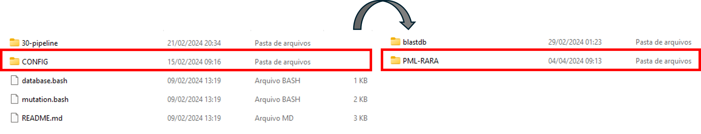
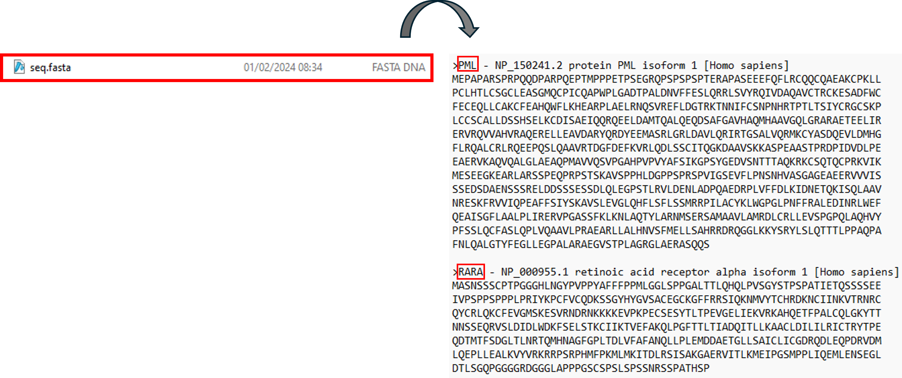
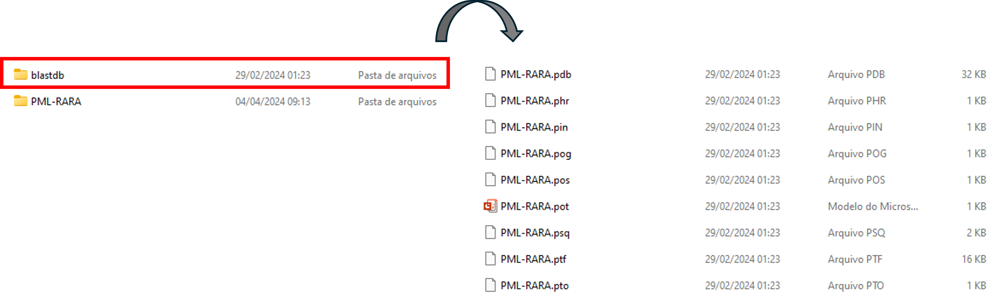
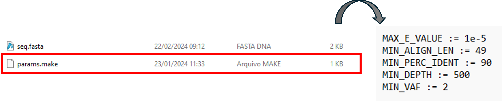
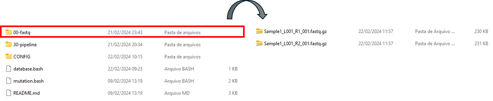
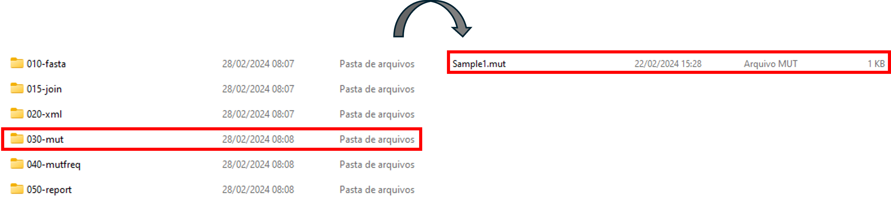

# How to use the Mutation Pipeline

This mutation pipeline uses BLAST to produce mutation reports. It is designed to run on Linux, but one can run it on Windows using git bash or Windows Subsystem for Linux (WSL).

# Installation 

To run from Windows Subsystem for Linux (WSL), install WSL following the instructions on learn.microsoft.com/windows/wsl/install. If you want to run from git bash, contact our support.

Install the `ncbi-blast+` package from your distribution. For that, open WSL terminal and run `sudo apt install ncbi-blast+`.

To download our software, click the "Clone or download" button on the top right of this page and copy the URL. In the directory where you want to run the software, paste the URL after a `git clone` command.

Change you working directory to the `2023-mutation` folder. Install the `python3-venv` package using the command `sudo apt install python3.10-venv`. If you get an error such as: 
```
This may mean that the package is missing, has been obsoleted, or is only available from another source
```
or
```
Package 'python3.10-venv' has no installation candidate
```
try to use `apt-get update` and `apt-get install python3-virtualenv` before running the command again.

Create a Python virtual environment with the command `python3 -m venv venv` and activate the virtual environment using `source venv/bin/activate`. After that, install pip in the venv directory using `sudo apt install python3-pip`, and run `pip install Bio` there. After installation, run `deactivate` to leave the virtual environment.

# Configuration

Define an *analysis*. You must give it a name starting with a letter and using just letters, numbers, and hyphens, without whitespace or other special characters. Create a subdirectory of CONFIG with the *analysis* name. For example:



You need a BLAST database with your proteins of interest. Create a FASTA file called `seq.fasta` with your translated genes of interest and place it in directory `CONFIG/analysis`, where *analysis* is the name of your analysis. Remember to define a name ID for your sequences in the FASTA file, which will identify the translated genes.  We have prepared a suitable file that you can download from [Zenodo](https://zenodo.org/records/10992331/files/PML-RARA.fasta?download=1).  Don't forget to change its name to `seq.fasta` (the origina name is PML-RARA.fasta).



After that, run

```
./database.bash analysis
```

This will create the BLAST database with the correct analysis name in `CONFIG/blastdb`. 



You also need to define:

- A **maximum e-value** to consider BLAST hits: it is the expected number of times that an alignment as good as this occurred by chance (the closer to 0, the better the alignment); 
- A **mininum alignment length**: minimum length of a read aligned with the reference, in aminoacids. For example, if the read length (bp) of a sequenced fragment is 150 bp, a good value for this parameter would be 50 or 49;
- A **minimum percent identity**: the minimum similarity with the reference for a BLAST alignment to be considered;
- A **minimum depth**: indicates the minumum number of reads should cover a specific mutated nucleotide. For example, if the aimed sequencing depth of a fragment was 1 million of reads, you should set the minimum depth you consider acceptable. It directly impacts reported mutations and VAF, because if you have a low read depth for a position and some of them are mutated, you can report a mutation with a high VAF that is actually an artifact of the technique.
- A **minimum VAF**: minimum percentage of mutated reads divided by the total reads for an aminoacid position.

These parameters must be placed in a file called `params.make` in the directory `CONFIG/analysis` in the following format:
```
MAX_E_VALUE := 1e-5
MIN_ALIGN_LEN := 49
MIN_PERC_IDENT := 90
MIN_DEPTH := 500
MIN_VAF := 2
```


Of course, you are free to change the above values in your configuration. Each analysis has its own parameters.

# Execution

Create a subdiretory `00-fastq` and copy `.fastq.gz` files into it, both R1 and R2 files.  We have prepared two such files that can be downloaded from Zenodo: [R1](https://zenodo.org/records/10992331/files/Sample1_L001_R1_001.fastq.gz?download=1) and [R2](https://zenodo.org/records/10992331/files/Sample1_L001_R2_001.fastq.gz?download=1).



Run
``` 
./mutation.bash 00-fastq/sample analysis 
```
to execute the analysis called *analysis*, on the fastq.gz sample file. The results will be placed in a file called `030-mut/sample.mut`, where *sample* is the sampe name.



You may check your results with our own results, available from [Zenodo](https://zenodo.org/records/10992331/files/Sample1.mut?download=1).


